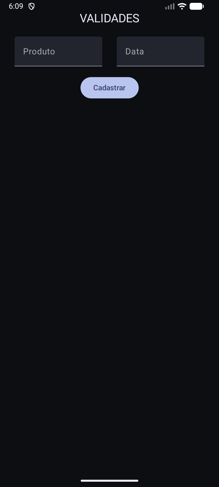
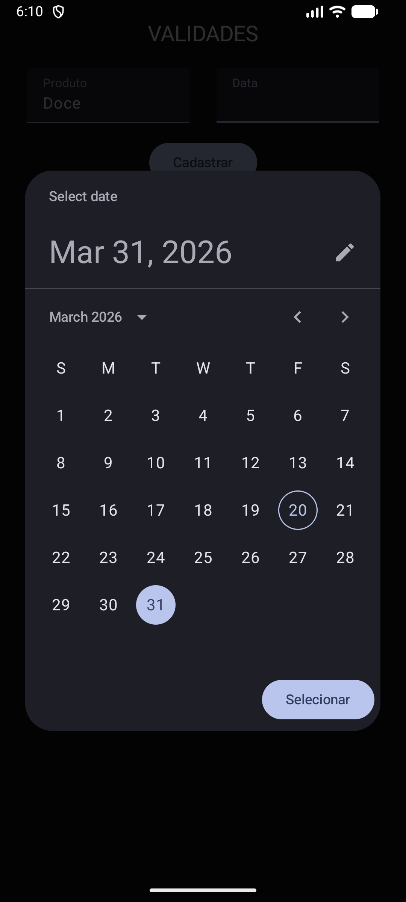
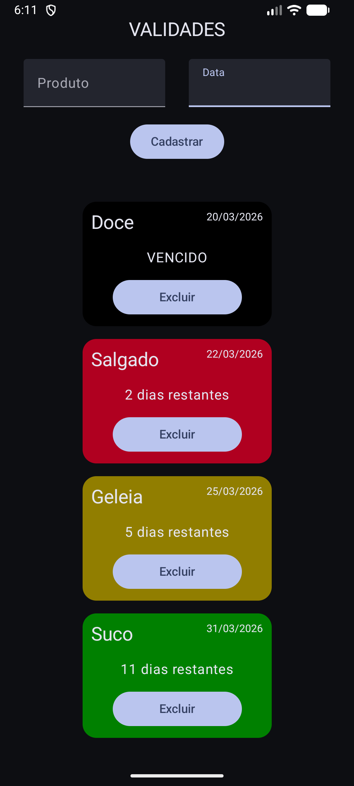

# 📦 Controle de Validade de Produtos

Aplicativo mobile desenvolvido em **Kotlin com Jetpack Compose** para controle simples e visual da validade de produtos.

---

## 🚀 Funcionalidades

* ✅ Cadastro de produtos com:

  * Nome
  * Data de validade

* 📋 Exibição em formato de **cards**

  * Nome do produto
  * Data de validade
  * Dias restantes para o vencimento

* ⏳ Cálculo automático de validade:

  * Mostra quantos dias faltam para vencer
  * Exibe **"Vencido"** quando a data já passou

* 🎨 Feedback visual por cores:

  * 🟢 **Verde** → Produto dentro do prazo
  * 🟡 **Amarelo** → Faltam até 7 dias
  * 🔴 **Vermelho** → Faltam até 3 dias
  * ⚫ **Preto** → Produto vencido

* ❌ Exclusão de produtos:

  * Cada card possui um botão para remover o item da lista

* 💾 Armazenamento local:

  * Os produtos ficam salvos no dispositivo

---

## 🧠 Objetivo do Projeto

Este projeto foi desenvolvido com foco em:

* Aprender e praticar **Jetpack Compose**
* Trabalhar com **gerenciamento de estado**
* Manipular listas dinâmicas
* Aplicar lógica com datas
* Criar interfaces modernas no Android

---

## 🛠️ Tecnologias Utilizadas

* Kotlin
* Jetpack Compose
* Material 3

---

## 📱 Como usar

1. Digite o nome do produto
2. Selecione a data de validade
3. Clique em **Cadastrar**
4. O produto será exibido na lista com:

   * Dias restantes
   * Cor indicativa de validade
5. Use o botão **Excluir** para remover produtos

---

## 📸 Preview

  

  

 

---

## 📌 Observação

Projeto com foco em aprendizado de desenvolvimento Android moderno.
